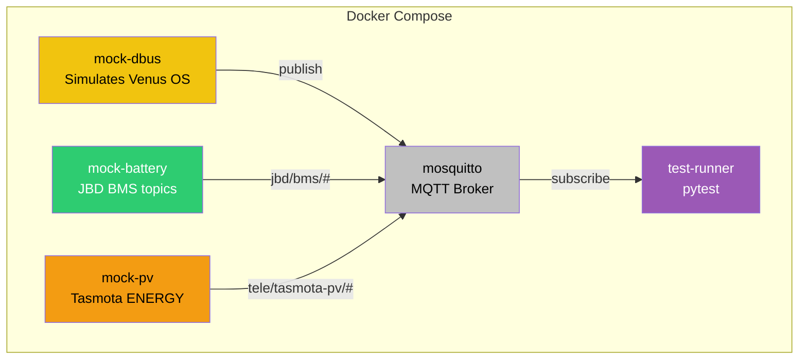

# Integration Tests

Environment for testing the complete data flow:
- MQTT broker (eclipse-mosquitto:2)
- Mock D-Bus (simulates Venus OS)
- Mock battery publisher (JBD BMS MQTT topics)
- Mock PV publisher (Tasmota energy topics)
- pytest test runner

Optional services (uncomment in `docker-compose.yml` when Dockerfiles exist):
- inverter-control
- inverter-dashboard-go

## Architecture



## Quick Start

```bash
# Run all tests
docker compose up --abort-on-container-exit

# Run specific test
docker compose run test-runner pytest tests/integration/test_mqtt_flow.py -v

# Watch logs
docker compose logs -f test-runner

# Cleanup
docker compose down -v
```

## Expected Test Flow

1. mosquitto starts (port 1883)
2. mock-dbus, mock-battery, and mock-pv publish simulated data
3. test-runner verifies:
   - MQTT pub/sub roundtrip (`test_mqtt_flow.py`)
   - Battery SOC topics (`test_battery_pv_mocks.py`)
   - Tasmota PV power topics (`test_battery_pv_mocks.py`)
   - WebSocket state propagation (when dashboard-go is enabled)

## CI

Scheduled weekly and on every push to `main` via `.github/workflows/integration.yml`.

## Debugging

```bash
# Watch MQTT traffic
docker compose exec mqtt-broker mosquitto_sub -v -t '#'

# Check control publishes
docker compose exec mqtt-broker mosquitto_sub -v -t 'inverter/#'

# Test MQTT manually
docker compose run --rm test-runner python -c "
import paho.mqtt.client as mqtt
c = mqtt.Client()
c.connect('mqtt-broker', 1883)
c.subscribe('inverter/#')
c.loop_forever()
"