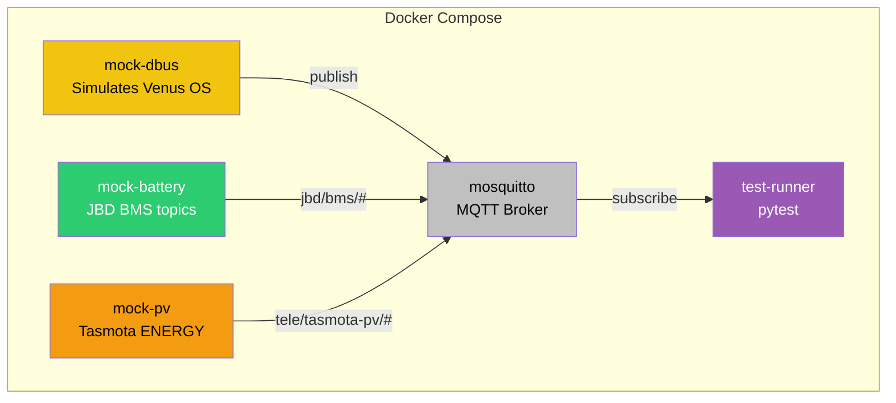

# Integration Tests

[](https://opensource.org/licenses/MIT)
[](https://github.com/victron-venus/integration-tests/actions/workflows/integration.yml)
[](https://www.python.org/downloads/)
[](https://www.docker.com/)

Environment for testing the complete data flow:
- MQTT broker (eclipse-mosquitto:2)
- Mock D-Bus (simulates Venus OS)
- Mock battery publisher (JBD BMS MQTT topics)
- Mock PV publisher (Tasmota energy topics)
- pytest test runner

Optional services (uncomment in `docker-compose.yml` when Dockerfiles exist):
- inverter-control
- inverter-dashboard-go

## Architecture


```mermaid
flowchart TB
    subgraph Docker["Docker Compose"]
        MQTT["mosquitto\nMQTT Broker"]
        DBD["mock-dbus\nSimulates Venus OS"]
        BAT["mock-battery\nJBD BMS topics"]
        PV["mock-pv\nTasmota ENERGY"]
        TEST["test-runner\npytest"]
    end

    DBD -->|"publish"| MQTT
    BAT -->|"jbd/bms/#"| MQTT
    PV -->|"tele/tasmota-pv/#"| MQTT
    MQTT -->|"subscribe"| TEST

    style MQTT fill:#c0c0c0,color:#000
    style DBD fill:#f1c40f,color:#000
    style BAT fill:#2ecc71,color:#fff
    style PV fill:#f39c12,color:#000
    style TEST fill:#9b59b6,color:#fff
```

## Quick Start

```bash
# Run all tests
docker compose up --abort-on-container-exit

# Run specific test
docker compose run test-runner pytest tests/integration/test_mqtt_flow.py -v

# Watch logs
docker compose logs -f test-runner

# Cleanup
docker compose down -v
```

## Test Scenarios

### MQTT Flow (`test_mqtt_flow.py`)
- MQTT pub/sub roundtrip
- Inverter state publishing to `inverter/state`
- State JSON format validation
- WebSocket state propagation (when dashboard-go is enabled)

### Battery & PV Mocks (`test_battery_pv_mocks.py`)
- Battery SOC, voltage on `jbd/bms/1/#` topics
- Tasmota PV power on `tele/tasmota-pv/#` topics

### D-Bus Battery/PV Scenarios (`test_dbus_battery_pv.py`)
- **Battery D-Bus**: SOC oscillation, voltage range, current polarity, state aggregation
- **PV D-Bus**: SystemType payload, grid power noise, Ve.Bus state=9 (Inverting)
- **End-to-end**: Concurrent battery+PV publishing, PV power updates, cell voltage consistency
- **Control loop latency**: D-Bus → MQTT propagation under 5 seconds

## CI

Runs on every push to `main`, every PR, and **daily at 04:00 UTC** via `.github/workflows/integration.yml`.

Manual dispatch supported via GitHub Actions UI.

### Reusable workflow (required status check)

Consumer projects (`inverter-control`, `inverter-dashboard`, `inverter-dashboard-go`) call this via `workflow_call` and add the resulting job as a **required check** in their branch protection rules.

#### Add to consumer workflow

```yaml
# .github/workflows/ci.yml
jobs:
  integration-tests:
    uses: victron-venus/integration-tests/.github/workflows/integration.yml@main
```

#### Set required check in branch protection

1. Repo **Settings → Branches → Branch protection rules** for `main`.
2. Under **Status checks that are required**, add the check named:
   - `integration-tests / integration` — for `workflow_call` consumers (recommended)
3. Enable **Require status checks to pass before merging**.

> The job key is `integration`; its display name is `Integration Tests`. When called via `workflow_call`, GitHub surfaces the check as `<consumer-job-name> / integration` in branch protection.

### Artifacts

Each run uploads (retention: 7 days):
- `integration-test-report-<dashboard>.html` — HTML test report
- `integration-junit-<dashboard>.xml` — JUnit XML
- `integration-logs-<dashboard>/` — container/stack logs

## Completed Features

- ✅ **CI Execution & Security**: Scheduled daily runs, hardened runner, and GitHub Step Summary reporting configured

## Debugging

```bash
# Watch MQTT traffic
docker compose exec mqtt-broker mosquitto_sub -v -t '#'

# Check control publishes
docker compose exec mqtt-broker mosquitto_sub -v -t 'inverter/#'

# Test MQTT manually
docker compose run --rm test-runner python -c "
import paho.mqtt.client as mqtt
c = mqtt.Client()
c.connect('mqtt-broker', 1883)
c.subscribe('inverter/#')
c.loop_forever()
"
```
